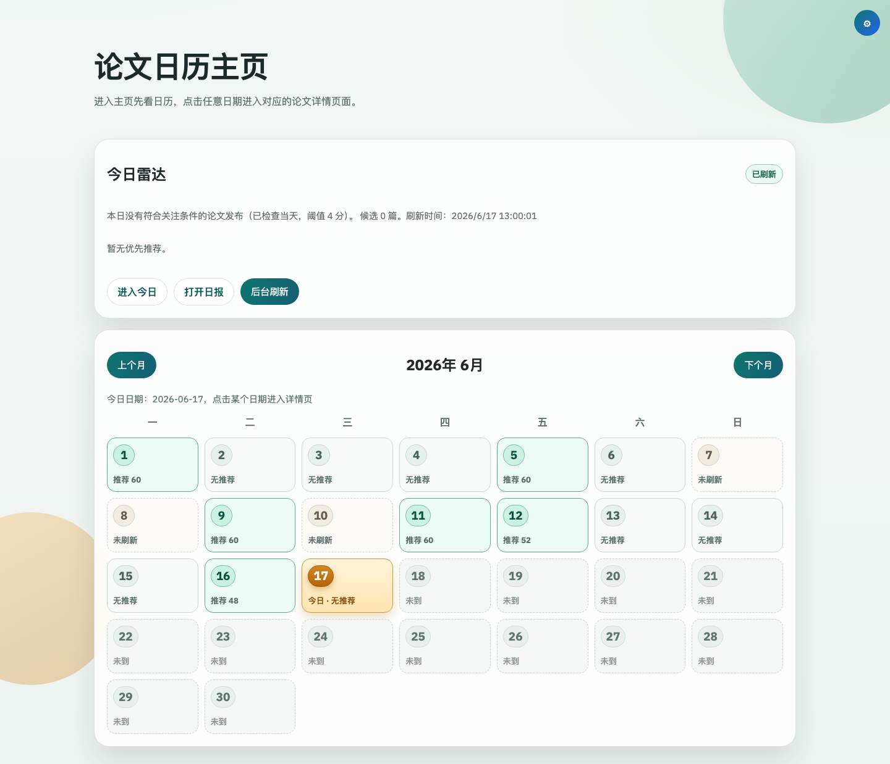
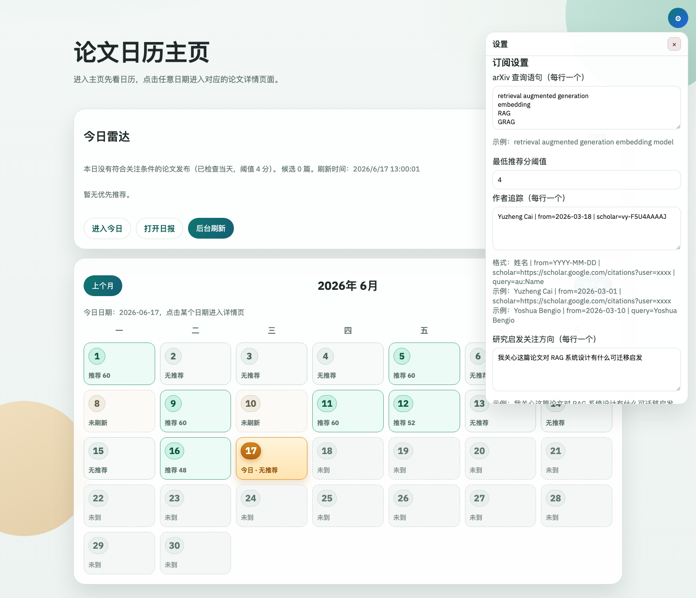

# paper-daily

## 经管顶刊追踪：手动试运行已核对，正式网站待确认（2026-09-10）

代码和正式论文历史已保存到[现有公开仓库](https://github.com/w1121188104w-hue/paper-daily)。首次服务器手动试运行的测试、数据保存和网页打包通过；两条来源记录缺标题，整体如实标为部分失败。**网站尚未发布，每日日程尚未启用。** 最新结果见[试运行核对](docs/github-trial-2026-09-09.md)。

当前共492条记录，包含476条研究候选、10条期刊资料、5条疑似更正、1条疑似撤稿；候选不等于逐篇人工确认。原487条及首次发现日期全部保留，5篇AER中文标题和完整摘要也原样保留。待翻译总计813个字段，其中研究候选471篇、797个字段可导出，另外16篇、16个字段暂缓。详见[中文样本](docs/aer-pilot-2026-09-09/样本与核对结果.md)、[分类规则](docs/document-classification.md)及[翻译操作](docs/phase-4-report.md)。

现已具备19刊双源采集、合并、长期保存、日志、60天回查、安全翻译导入，以及只读日历、日期详情、双语卡片、期刊筛选与中英文搜索。日期保留来源的年／月／日精度，不冒充逐篇核实的官网日期；作者不同写法可展开对照，不猜测或拼接身份。

185项自动化测试全部通过；Windows与服务器之间的正式数据换行保护已实测。正式历史为3个版本、93个文件，已取回本地并通过完整校验。先前487条数据下的浏览器操作和320／390／768／1366像素宽度验收见[本地验收记录](docs/local-release-acceptance-2026-09-09.md)；本次网页代码未变，没有重复声称已完成真实Pages地址验收。

公开范围已确定为公开仓库＋公开、免登录的阅读网站，代码、正式论文记录及来源原始记录可公开保存；不再实现团队登录或拆分私有数据。密钥、个人账号配置、旧工具阅读／收藏记录、翻译草稿及未保存尝试仍排除。见[公开阅读方案](docs/public-reading-scope.md)。

`.github/workflows/`中的首次版本只接受手动运行，没有推送触发或每日日程。采集开关已开启以支持手动试运行，网站发布开关仍未设置；`deploy/github/*.yml.example`中的日程只是未启用示例。正式公开网站发布前仍需用户确认。服务器采集不调用AI，也不需要配置翻译密钥，见[运行说明](deploy/github/README.md)。

界面沿用 [paper-daily](https://github.com/limafang/paper-daily)，采集与静态归档思路参考 [AI-academia-bot](https://github.com/coujasmine/AI-academia-bot)。根据用户提供的V0.1需求说明，paper-daily原作者已授权复用；本仓库保留原项目历史，授权依据由项目持有人保存。

本机只读查看：运行`node scripts/journal-preview.js`，打开 <http://127.0.0.1:4317/>；按`Ctrl+C`停止。“重新读取本地数据”不触发采集或翻译。本地静态打包使用`node scripts/build-journal-site.js`，输出在`data/site-builds/`，不会自动上传或发布。

只读检查和测试：

```powershell
node --test
node scripts/journals.js
node scripts/journal-library.js --status
node scripts/journal-git-files.js --check
node scripts/translations.js --queue
node scripts/journal-preview.js --check
```

这些命令不联网，也不会启动旧服务。测试只操作自己的临时目录，不改正式论文库。不要把早期AER保存验收脚本中的固定数量用于当前库，它们只适用于当时的阶段快照。

新正式文件仍默认被Git忽略，仅通过校验后的完整历史清单显式暂存；不要加入整个`data/`。备份需覆盖整个`data/journal-store/`，不能只取最新快照目录，版本控制也不替代独立备份。历史操作说明见[第三阶段](docs/phase-3-report.md)、[第五阶段](docs/phase-5-report.md)及[19刊标识核验](docs/journal-verification.md)。

以下是原有 arXiv 工具的说明，暂时保留供旧功能使用。**不要将下方的 `npm start` / `npm run refresh` 当作新系统检查命令：它们会启动旧采集流程并可能写入旧数据。**

---

paper-daily 是一个个人用的每日 arXiv 论文推荐工具。它会按你的研究兴趣每天抓取论文、打分排序、生成中文扫读日报，并把结果按日历保存下来，适合每天花几分钟看看有没有值得读的新文章。



## 功能

- 每天自动拉取 arXiv 当日论文，并按订阅条件筛选推荐。
- 首页用日历区分“有推荐、无推荐、未刷新、部分结果、刷新失败”。
- 支持后台刷新、启动后自动补刷最近缺失日期，以及重试失败任务。
- 支持作者追踪，可以使用 Google Scholar 链接辅助识别作者论文。
- 支持用户自己的 OpenAI-compatible API key，用于日报润色、论文摘要、研究启发和论文问答。
- 所有个人配置、API key、阅读记录和缓存都保存在本地 `data/`，默认不会上传到 git。

## 界面预览

首页查看今天摘要和历史日历：


日期详情页查看当天推荐、作者更新和日报入口：


设置面板配置查询、作者追踪和 LLM API：



## 安装

需要 Node.js 18 或以上。

```bash
git clone https://github.com/limafang/paper-daily.git
cd paper-daily
npm install
cp .env.example .env
```

然后启动：

```bash
npm start
```

打开：

```text
http://localhost:3000
```

开发时可以使用 watch 模式：

```bash
npm run dev
```

## 第一次配置

打开首页右上角设置按钮，至少配置一条 arXiv 查询语句。

常用配置：

- `arXiv 查询语句`：每行一个方向，例如 `retrieval augmented generation embedding model`
- `最低推荐分阈值`：默认 `4`，越高越严格
- `作者追踪`：每行一个作者
- `研究启发关注方向`：告诉 AI 你读论文时关心什么
- `LLM 设置`：填写 Base URL、API Key、Model 等

作者追踪示例：

```text
Yuzheng Cai | from=2026-03-01 | scholar=https://scholar.google.com/citations?user=xxxx
Yoshua Bengio | from=2026-03-10 | query=au:Yoshua Bengio
```

字段说明：

- `from=YYYY-MM-DD`：从哪天开始追踪更新
- `scholar=...`：Google Scholar 主页链接或 Scholar ID
- `query=...`：可选的 arXiv 作者查询；建议用 `au:Author Name`

## API Key 怎么放

不要把真实 API key 写进源码、README 或提交到 git。

推荐两种方式：

1. 在网页设置面板里填写 LLM 配置。配置会保存在本地 `data/llm-settings.json`，该目录已被 `.gitignore` 忽略。
2. 使用 `.env` 或部署环境变量。先复制样例：

```bash
cp .env.example .env
```

然后填写：

```env
LLM_BASE_URL=https://api.openai.com/v1
LLM_API_KEY=你的-key
LLM_MODEL=gpt-4o-mini
JINA_API_KEY=
```

`JINA_API_KEY` 是可选项，用于 Google Scholar 页面读取。如果不使用作者追踪或不需要 Jina Reader，可以留空。

## 日常使用

### 看今天推荐

打开首页，今天的摘要会显示在“今日雷达”区域。点击“进入今日”可以打开当天详情页。

### 手动刷新某一天

进入某个日期详情页，点击“获取当日论文推荐”。刷新时页面会显示进度条。

### 看日报

刷新完成后点击“打开日报”。如果配置了 LLM API，系统会尝试生成润色后的中文日报；失败时会回退到模板日报。

### 读单篇论文

在日期详情页点击某篇论文卡片，进入阅读页。阅读页支持：

- 查看 PDF
- 生成论文摘要
- 根据你的研究方向生成启发
- 和论文内容对话
- 收藏 Mark

## 自动刷新与补刷

服务启动后会自动处理：

- 每天 `08:10` 刷新当天推荐
- 每天 `13:00` 检查补刷
- 启动时检查今天是否缺失
- 打开页面时触发轻量补刷检查
- 对失败、部分失败、中断任务自动重试

默认环境变量：

```env
REFRESH_CRON=10 8 * * *
REFRESH_CATCHUP_CRON=0 13 * * *
REFRESH_TIMEZONE=Asia/Shanghai
REFRESH_RETRY_MINUTES=30
REFRESH_RETRY_LIMIT=3
CATCHUP_LOOKBACK_DAYS=7
CATCHUP_FAILED_LOOKBACK_DAYS=30
CATCHUP_MAX_DATES=3
CATCHUP_DELAY_MS=120000
```

含义：

- `CATCHUP_LOOKBACK_DAYS=7`：补最近 7 天未刷新的日期
- `CATCHUP_FAILED_LOOKBACK_DAYS=30`：补最近 30 天失败、部分失败或中断的记录
- `CATCHUP_MAX_DATES=3`：每轮最多补 3 天
- `CATCHUP_DELAY_MS=120000`：补刷日期之间间隔 120 秒，降低 arXiv 429 风险

## 长期运行

本地长期运行可以直接用：

```bash
npm start
```

macOS 推荐使用 launchd，具体见 [docs/deployment.md](docs/deployment.md)。

常用检查命令：

```bash
curl http://localhost:3000/api/digest/refresh-status
tail -f logs/paper-daily.out.log
tail -f logs/paper-daily.err.log
```

## 本地数据

运行时数据在 `data/`：

- `subscriptions.json`：订阅和作者追踪
- `llm-settings.json`：网页设置保存的 LLM 配置，可能包含 API key
- `digests.json`：每日推荐结果
- `daily-reports/`：每日 Markdown 日报
- `marks.json`：收藏记录
- `paper-ai-cache.json`：论文摘要、启发、问答缓存
- `refresh-state.json`：刷新状态和重试历史
- `author-track-state.json`：作者追踪基线

这些运行数据默认不会提交到 git。公开仓库只保留 `data/README.md`、`data/.gitkeep`、空 key 的样例文件，以及不含密钥的期刊名单 `data/config/journals.json`。

## 常用命令

```bash
npm install
npm start
npm run dev
npm run refresh
```

`npm run refresh` 会执行一次当天刷新后退出，适合外部定时任务。

## 故障排查

### 端口被占用

```bash
lsof -nP -iTCP:3000 -sTCP:LISTEN
```

如果已经有旧服务在跑，先停掉旧服务或换一个 `PORT`。

### arXiv 429

这是 arXiv 限流。paper-daily 已经内置请求间隔、超时、重试和补刷队列。可以适当调大：

```env
ARXIV_REQUEST_DELAY_MS=5000
ARXIV_MAX_ATTEMPTS=4
CATCHUP_DELAY_MS=180000
```

### AI 日报或摘要失败

检查：

- `LLM_API_KEY` 是否填写
- `LLM_BASE_URL` 是否是 OpenAI-compatible `/v1`
- `LLM_MODEL` 是否可用
- `LLM_TIMEOUT_MS` 是否太短

失败时系统会保留基础模板日报，不影响论文抓取。

## 公开仓库注意事项

提交前建议检查：

```bash
git status --ignored
git check-ignore -v data/llm-settings.json .env logs/paper-daily.out.log
```

确认 `data/llm-settings.json`、`.env`、日志和 `node_modules/` 都没有被提交。
